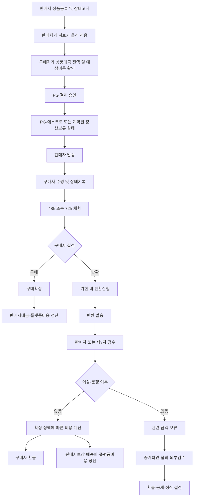
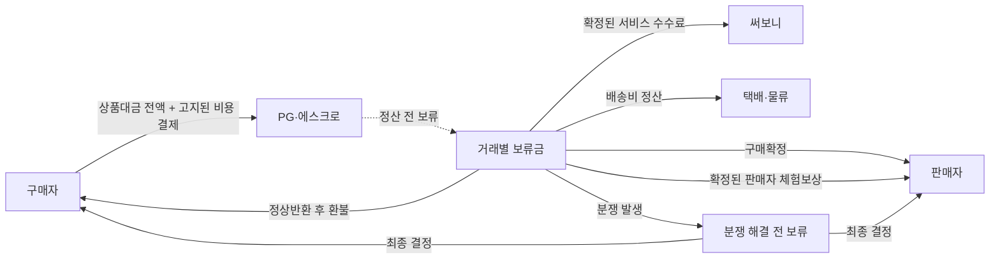

# 써보니 법률 자문용 거래·자금 흐름도 v0.1

> 작성일: 2026-08-31  
> 문서 상태: 법률 자문 사전검토용 초안  
> 관련 문서: `써보니_Codex_개발_마스터기획_v1.1.md`, `써보니_PG사_공통문의서_v0.1.md`  
> 목적: 거래 당사자의 역할, 결제대금 흐름, 구매·반환·분쟁 시나리오 및 미확정 법률 쟁점을 변호사에게 정확히 전달  
> 주의: 아래 내용은 희망 구조와 검토 질문이며 법적 결론이나 확정 약관이 아닙니다.

---

## 1. 서비스 개요

써보니는 일반 중고거래를 기본으로 하되, 판매자가 허용한 상품에 한해 구매자가 일정 시간 실제로 사용한 뒤 구매 또는 유료 반환을 선택하는 거래 옵션을 제공하려는 플랫폼이다.

- 일반거래: 결제 → 발송 → 수령 → 구매확정 → 판매자 정산
- 써보기 거래: 선결제 → 발송 → 수령 → 제한된 체험 → 구매 또는 반환 → 정산·환불
- 판매자: 개인판매자와 사업자판매자가 모두 참여할 가능성이 있음
- 구매자: 본인확인을 완료한 소비자 또는 이용자
- 초기 검증 후보: 중고 노트북 등 배송 가능한 고가 전자제품
- 플랫폼은 PG·에스크로 계약을 이용하고 임의로 고객자금을 직접 보관하지 않는 방안을 우선 검토

## 2. 자문을 통해 확정하려는 사항

1. 플랫폼의 법적 지위와 거래 당사자 관계
2. 개인판매자와 사업자판매자 거래의 법적 차이
3. 선결제 후 체험·구매·유료반환 구조의 허용조건
4. 상품대금, 옵션비, 배송비, 판매자 보상의 법적 성격
5. 서비스상 반환권과 법정 청약철회권·하자담보책임의 관계
6. 미응답 자동구매확정의 허용조건과 소비자 보호장치
7. 반환검수와 분쟁 중 정산보류의 적법한 범위
8. 플랫폼이 손해액을 산정·공제·배분할 수 있는 범위
9. 필요한 약관, 고지, 별도 동의, 본인확인 및 기록
10. 별도 등록·신고·라이선스·보증보험 필요 여부

## 3. 거래 당사자와 예정 역할

| 당사자 | 예정 역할 | 대금 관련 예정 역할 | 확인할 법적 쟁점 |
|---|---|---|---|
| 구매자 | 상품 선택, 선결제, 수령, 체험, 구매·반환 결정 | PG 결제, 환불 수령, 필요 시 비용 부담 | 소비자 해당 여부, 청약철회·환불·하자 권리 |
| 개인판매자 | 상품등록, 상태고지, 발송, 반환검수 | 구매대금 또는 체험보상 정산 수령 | 통신판매업자 해당 가능성, 반복판매 기준 |
| 사업자판매자 | 상품등록, 표시·고지, 발송, 반환검수 | 구매대금 또는 체험보상 정산 수령 | 전자상거래법상 의무, 청약철회·표시의무 |
| 써보니 | 거래중개, 정책·UI, 상태기록, CS·분쟁 프로세스 | PG 요청, 정산지시 또는 분할정산 연계 검토 | 통신판매중개자/판매당사자 여부, 책임 범위 |
| PG·에스크로사 | 결제승인, 대금보관, 취소·환불·정산 | 계약에 따른 대금 보관·이체 | 결제대금예치·정산 구조와 계약상 제한 |
| 택배사 | 배송·반환 물류, 인수·배송증빙 | 배송비 수취 | 멸실·훼손 시점과 책임 연결 |
| 검수기관 후보 | 분쟁 또는 고가상품 상태검수 | 검수비 수취 가능 | 독립성, 판정 효력, 개인정보·상품 접근 |

위 역할은 확정되지 않았다. 특히 플랫폼이 거래 당사자로 평가될 수 있는 행위와 단순 중개 범위를 자문받고자 한다.

## 4. 전체 거래 흐름



## 5. 자금 흐름 개요



희망 구조일 뿐이며, 실제로 PG가 복수 수취인 분할정산이나 구매확정 전 부분환불을 지원하는지는 별도 문의 중이다.

## 6. 금액 구성 후보

| 금액 | 의미 후보 | 구매 시 | 정상반환 시 | 법률 자문 쟁점 |
|---|---|---|---|---|
| 상품대금 | 매매대금 | 판매자에게 정산 | 구매자에게 환불 후보 | 선결제·보관·환불 조건 |
| 옵션비 | 구매결정 선택권 또는 서비스 이용대가 후보 | 전액·일부 유지 또는 상계 미정 | 전액·일부 공제 후보 | 명칭보다 실질, 청약철회권 우회 여부 |
| 판매자 체험보상 | 사용·재고점유·감가 보상 후보 | 상계 또는 별도정산 미정 | 판매자 지급 후보 | 손해배상·위약금·사용대가 중 성격 |
| 왕복배송비 | 실제 물류비 | 편도 또는 포함 미정 | 구매자 부담 후보 | 사전고지 및 귀책사유별 부담 |
| 플랫폼 수수료 | 중개·결제·운영 서비스 대가 후보 | 부과 방식 미정 | 부과 방식 미정 | 표시·환불·과세 및 판매당사자성 영향 |
| 위험준비금 | 내부 원가 또는 별도 부과 후보 | 외부 부과 미정 | 외부 부과 미정 | 소비자에게 별도 청구 가능한지 |
| 검수비 | 제3자 상태검수 비용 후보 | 통상 없음 | 분쟁·고가상품 시 후보 | 귀책 확정 전 부담 주체 |

금액과 비율은 모두 미확정이다. 실제 근거 없이 0원 또는 임의 금액으로 확정하지 않는다.

## 7. 시나리오별 거래·자금 처리 후보

### 7.1 구매확정

```text
구매자 선결제
→ 체험 완료
→ 명시적 구매확정
→ PG 보류 해제
→ 판매자대금 정산
→ 확정된 플랫폼 수수료·배송비 처리
```

자문 질문:

- 옵션비 또는 체험보상을 매매대금과 분리할 필요가 있는가?
- 사업자판매자와 개인판매자의 영수증·현금영수증·세금처리가 달라지는가?
- 상품 수령과 구매확정 사이 위험부담과 소유권 이전 시점을 어떻게 정해야 하는가?

### 7.2 정상반환

```text
기한 내 반환신청
→ 구매자 반환발송
→ 판매자 또는 제3자 검수
→ 정상 사용범위 확인
→ 상품대금 환불
→ 사전 고지되고 적법한 비용만 공제·정산
```

자문 질문:

- 반환 자체에 옵션비·체험보상·배송비를 부과할 수 있는 조건은 무엇인가?
- 사업자판매자의 법정 청약철회에 따른 반환과 별도의 유료 체험반환을 어떻게 구분해야 하는가?
- 소비자의 권리를 제한하거나 우회하는 조항으로 해석되지 않으려면 무엇을 고지해야 하는가?
- 개인판매자 거래에서도 플랫폼이 독자적인 반환권을 계약으로 제공할 수 있는가?

### 7.3 구매자 미응답

```text
체험 종료 전 반복 알림
→ 반환신청 마감시각 도래
→ Grace Period
→ 미응답 상태 처리
```

희망안은 일정 조건에서 구매확정 처리하는 것이지만 법률·PG 검토 전 활성화하지 않는다.

자문 질문:

- 고객의 부작위를 구매의사로 간주할 수 있는 요건은 무엇인가?
- 신청 시 별도 동의만으로 충분한가, 만료 시점의 개별 고지·도달증명이 필요한가?
- 배송지연·시스템장애·입원 등 예외사유와 사후구제 절차는 어떻게 정해야 하는가?
- 내부 구매확정 후에도 법정 청약철회·하자 권리는 어떻게 보존·고지해야 하는가?

### 7.4 단순변심 반환 중 지연

```text
기한 내 반환신청
→ 정해진 발송기한 경과
→ 알림 및 소명기회
→ 거래상태·비용 처리
```

자문 질문:

- 반환신청 후 미발송에 부과 가능한 합리적인 비용과 조치 범위는 무엇인가?
- 자동구매확정 또는 지연손해금 처리 전 필요한 최고·유예기간은 무엇인가?

### 7.5 하자·상품상이

```text
구매자 하자신고
→ 관련 금액 보류
→ 발송 전후 상태증거 비교
→ 귀책 확인
→ 전액환불·부분환불·정산 중 결정
```

자문 질문:

- 사업자·개인판매자별 하자담보책임과 입증책임은 어떻게 다른가?
- 플랫폼이 증거기준을 정하고 1차 판단하는 것이 가능한가?
- 하자신고 시 옵션비·배송비·검수비를 구매자에게 부담시킬 수 없는 경우는 무엇인가?

### 7.6 체험 중 파손·분실·미반환

```text
사고 신고 또는 반환기한 경과
→ 관련 금액 보류
→ 상태증거·배송증빙·수리견적 확인
→ 실제 손해 산정
→ 당사자 협의 또는 외부 분쟁절차
```

자문 질문:

- 정상 사용흔적과 배상 대상 손상의 기준을 약관·정책으로 정할 수 있는가?
- 플랫폼이 구매자 결제금에서 수리비·감가액을 일방 공제할 수 있는가?
- 미반환 시 매매확정으로 전환하는 조항의 유효조건은 무엇인가?
- 보증보험·별도 담보·추가 결제가 필요한가?

### 7.7 판매자 검수 지연 또는 부당 거절

```text
반환상품 도착
→ 판매자 검수기한 경과 또는 이상 주장
→ 자동환불 여부 검토
→ 제3자 검수 또는 분쟁절차
```

자문 질문:

- 판매자에게 허용할 합리적인 검수시간은 얼마인가?
- 기한 내 이의제기가 없으면 정상반환으로 간주할 수 있는가?
- 판매자 주장만으로 환불을 장기간 보류하지 않기 위한 기준은 무엇인가?

### 7.8 차지백·결제취소

```text
구매자 카드사 이의제기
→ PG 통지
→ 거래·배송·상태·동의 증빙 제출
→ 차지백 결과에 따른 정산조정
```

자문 질문:

- 판매자에게 이미 정산된 경우 플랫폼이 부담하거나 회수할 범위는 무엇인가?
- 판매자 계약에 필요한 정산상계·환수 조항은 무엇인가?

## 8. 권리와 상태를 분리할 원칙 후보

- 서비스 내부의 `구매확정`이 법정 청약철회권·하자 권리의 자동 소멸을 의미하지 않게 한다.
- 일반 중고거래, 써보기 계약, 배송, 결제·에스크로의 상태를 구분한다.
- 개인판매자와 사업자판매자의 권리·의무를 동일하다고 가정하지 않는다.
- 구매자의 단순변심, 판매자 미고지 하자, 배송사고, 구매자 파손을 구분한다.
- 미확정 비용을 0원이나 임의 금액으로 채우지 않는다.
- 분쟁 중에는 다툼이 있는 범위의 금액만 보류하는 방안을 우선 검토한다.
- 회사의 판단이 최종이며 이의제기가 불가능하다는 조항은 사용하지 않는다.
- 손해배상액은 실제 손해 및 합리적 근거와 연결하고 과도한 위약금으로 만들지 않는다.

위 원칙의 적절성과 필요한 예외를 자문받고자 한다.

## 9. 필요한 동의·증거·기록 후보

| 시점 | 기록 후보 | 목적 |
|---|---|---|
| 회원가입 | 신원·연락처·판매자 유형 | 당사자 확인 |
| 상품등록 | 시리얼, 상태, 하자, 구성품, 사진·영상 | 판매 전 상태증거 |
| 써보기 신청 | 기간, 총 결제액, 비용 구성, 반환기한, 자동처리 후보 별도 동의 | 계약내용 확인 |
| 결제 | PG 거래ID, 승인금액, 결제수단, 에스크로 상태 | 자금 추적 |
| 발송·수령 | 운송장, 인수·배송완료 시각 | 위험 이전과 기간 기산 |
| 체험 시작 | 기산시각, 종료시각, 알림 계획 | 기한 분쟁 방지 |
| 구매·반환 결정 | 명시적 의사표시와 시각 | 거래결정 증명 |
| 반환 | 운송장, 포장·발송 증거 | 반환 이행 확인 |
| 검수 | 전후 상태비교, 수리견적, 이의제기 | 비용·귀책 판단 |
| 환불·정산 | 계산내역, 승인자, PG 결과 | 금액처리 감사 |
| 분쟁 | 주장, 증거, 조치, 보류범위, 이의절차 | 절차적 공정성 |

개인정보 최소수집, 보관기간, 영상·시리얼 처리, 제3자 제공 근거도 함께 자문받는다.

## 10. 법률 자문 핵심 질문표

| 번호 | 질문 | 중요도 | 자문 의견 | 후속조치 |
|---|---|---|---|---|
| L-01 | 써보니의 법적 지위와 판매당사자성 판단요소 | 필수 | | |
| L-02 | C2C 개인판매자와 사업자판매자의 분리기준 | 필수 | | |
| L-03 | 선결제→체험→구매/반환 구조의 허용조건 | 필수 | | |
| L-04 | PG 에스크로 이용 시 별도 전자금융 관련 등록 필요 여부 | 필수 | | |
| L-05 | 옵션비·체험보상·배송비의 법적 성격 | 필수 | | |
| L-06 | 서비스상 반환권과 법정 청약철회권의 관계 | 필수 | | |
| L-07 | 미응답 자동구매확정의 유효조건 | 필수 | | |
| L-08 | 분쟁 중 정산보류 및 플랫폼 판정 권한 | 필수 | | |
| L-09 | 파손·미반환 시 손해액 공제·배상 구조 | 높음 | | |
| L-10 | 판매자 검수기간과 무응답 처리 | 높음 | | |
| L-11 | 플랫폼·판매자·구매자 필수 약관과 고지 | 필수 | | |
| L-12 | 본인확인, 시리얼·영상 등 개인정보 처리 | 높음 | | |
| L-13 | 세금계산·영수증·현금영수증 발급 주체 | 높음 | | |
| L-14 | 별도 업종등록·신고·보증보험 필요 여부 | 필수 | | |
| L-15 | 분쟁해결기준과 외부조정·관할 절차 | 높음 | | |

## 11. 자문 결과에 따른 개발 게이트

법률 자문 결과는 다음 중 하나로 기록한다.

| 판정 | 의미 | 개발조치 |
|---|---|---|
| `GO` | 전제조건을 충족하면 희망 구조 사용 가능 | 승인된 범위만 거래기능 설계 |
| `MODIFY` | 거래·비용·역할 구조 변경 필요 | 문서·FSM·PG 문의사항 수정 후 재검토 |
| `STOP` | 핵심 구조를 적법하게 운영하기 어려움 | Phase C/P2 동결 유지, 사업모델 재설계 |

다음 항목이 서면으로 확정되기 전에는 실제 결제·정산·자동구매확정 기능을 활성화하지 않는다.

- 거래 당사자와 플랫폼의 법적 역할
- 허용되는 자금흐름
- 옵션비와 판매자 보상의 성격
- 반환·환불·자동확정 조건
- 개인판매자와 사업자판매자별 정책
- 분쟁 중 보류·공제·정산 권한
- 필요한 약관·고지·동의·등록·보험

## 12. 변호사에게 함께 제공할 자료

- 써보니 마스터 기획 v1.1
- PG사 공통 문의서 및 PG별 서면 답변
- 구매자·판매자 화면 초안
- 결제금액 구성 예시 — 실제 값 확정 전에는 가정임을 표시
- 상품상태 기록 예시
- WTA/WTP 및 단위경제성 검증 결과
- 개인판매자·사업자판매자 운영안
- 약관·개인정보처리방침 초안 — 작성된 경우

## 13. 자문 요청 메일 요약

```text
일반 중고거래 플랫폼에서 판매자가 허용한 상품을 구매자가 전액 선결제하고,
수령 후 48시간 또는 72시간 사용한 뒤 구매나 유료 반환을 선택하는 모델을 검토하고 있습니다.

플랫폼은 PG·에스크로를 이용하고 직접 고객자금을 보관하지 않는 구조를 우선 검토 중입니다.
다만 옵션비, 판매자 체험보상, 반환배송비, 미응답 자동구매확정,
반환검수 및 분쟁 중 정산보류가 전자상거래법·약관규제법·전자금융 관련 규정상
어떤 조건에서 가능한지 확인이 필요합니다.

첨부한 당사자 관계, 거래·자금 흐름, 시나리오와 질문표를 기준으로
가능한 구조, 수정이 필요한 구조, 피해야 할 구조 및 필수 약관·신고사항에 대해
서면 의견을 요청드립니다.
```

---

이 문서는 법률 자문을 효율적으로 받기 위한 사실관계·희망구조 정리본이다. 자문 결과에 따라 서비스 정의, 거래 FSM, 결제·환불·정산 정책 및 개발범위를 수정한다.
